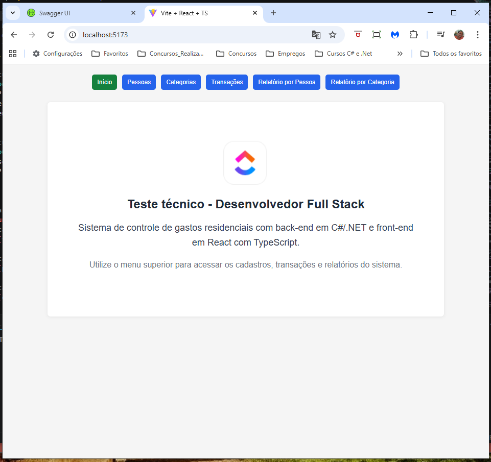
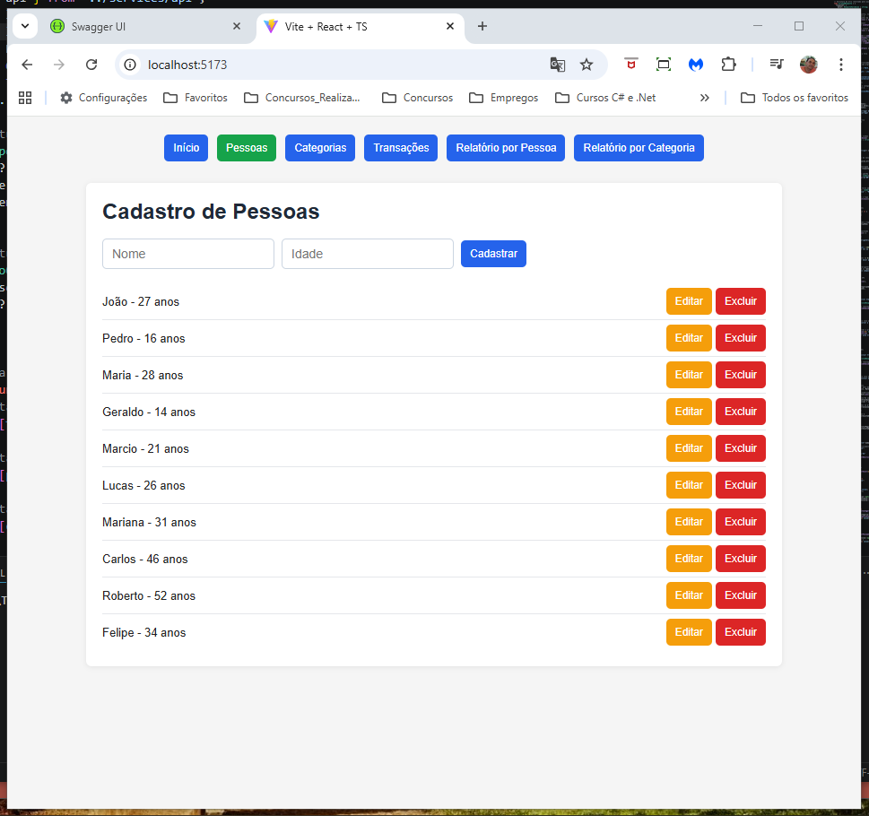
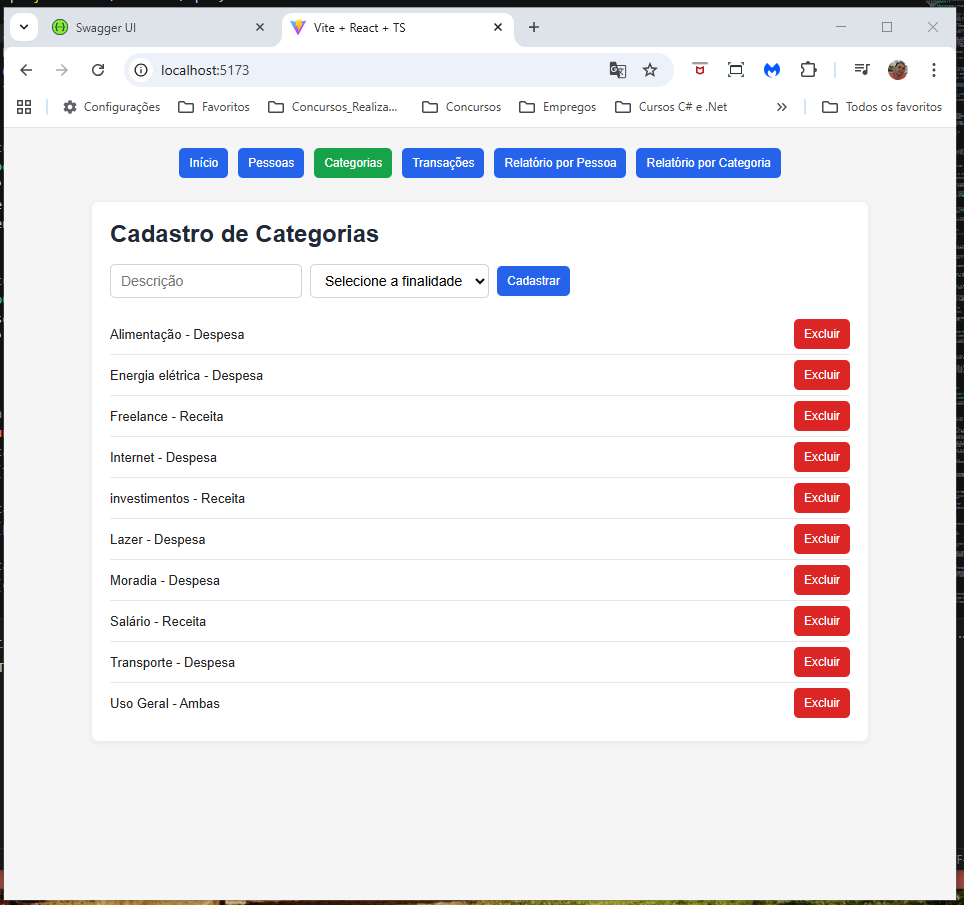
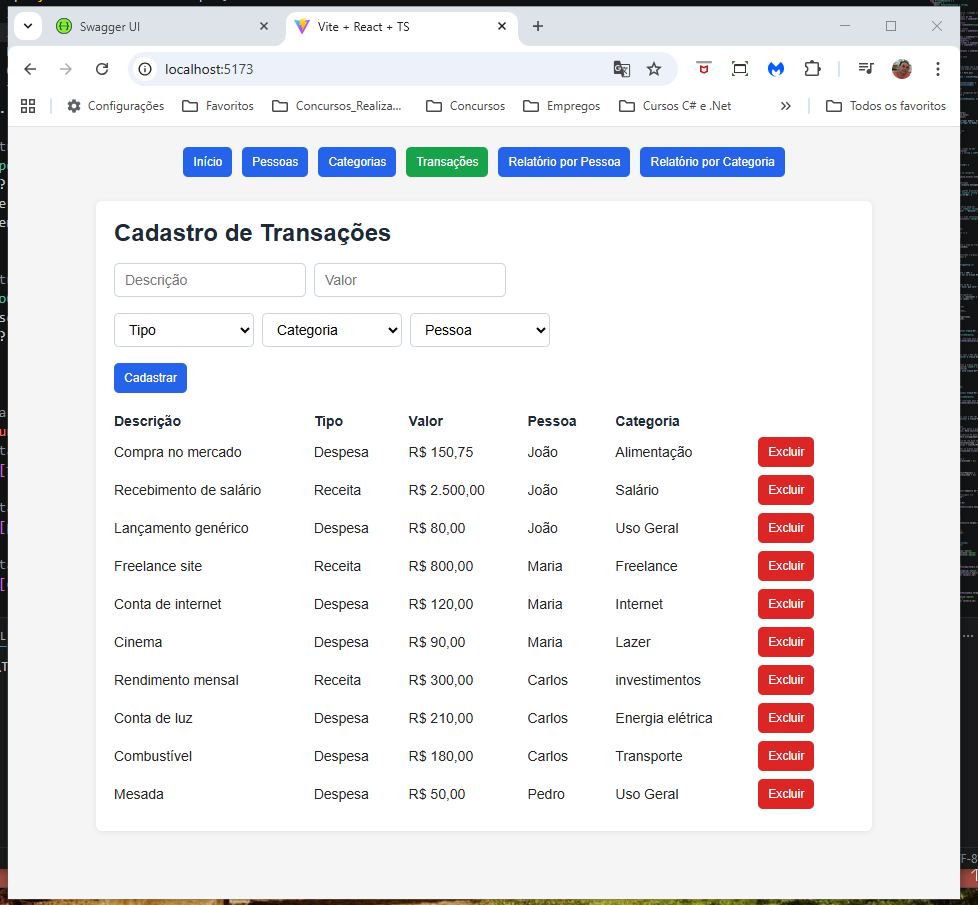
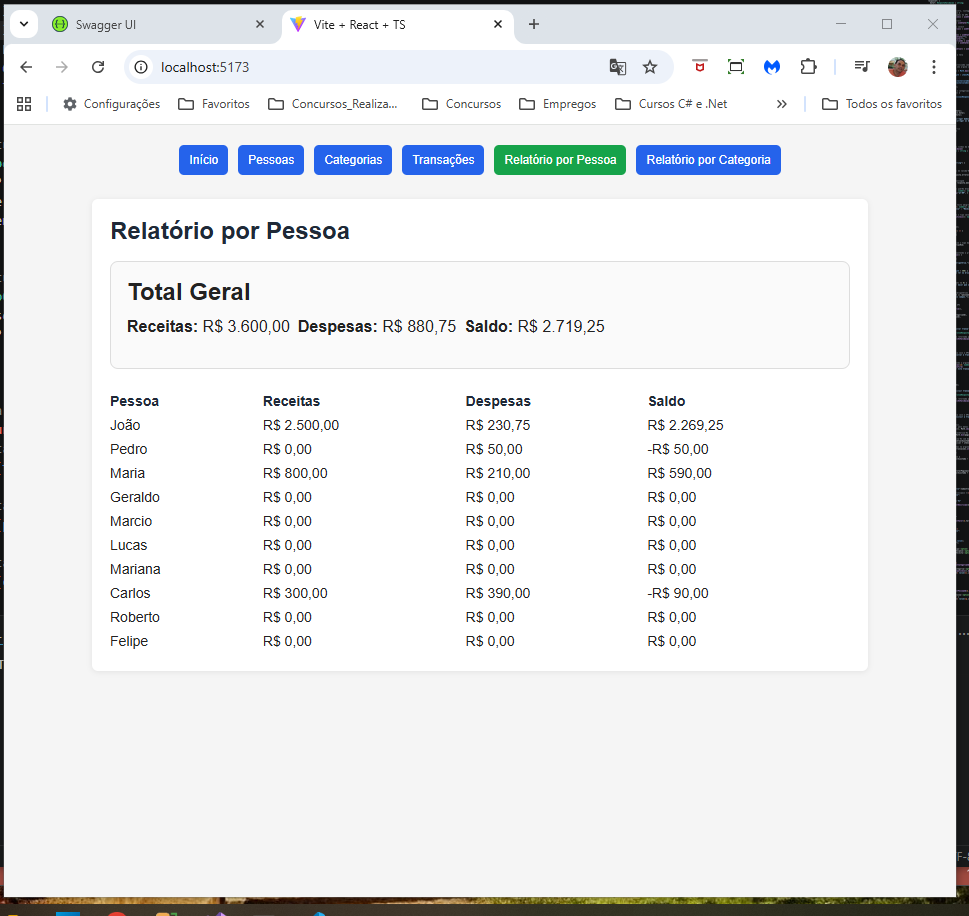
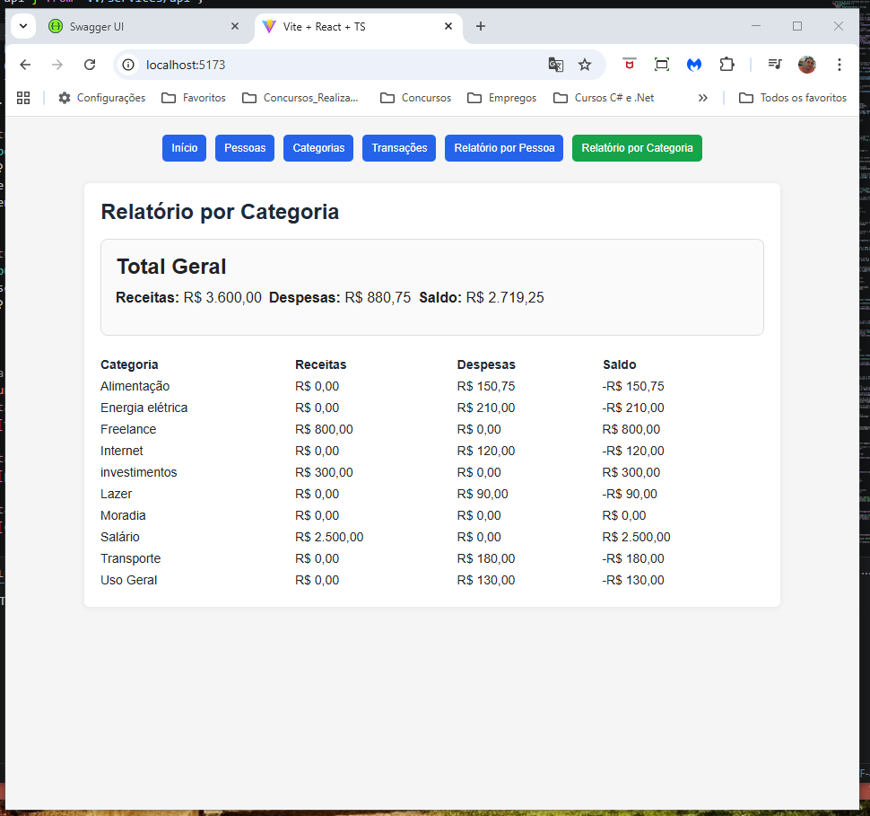

# 💰 Sistema de Controle de Gastos Residenciais

Projeto desenvolvido como teste técnico para vaga de **Desenvolvedor Full Stack**.

O sistema permite gerenciar pessoas, categorias e transações financeiras, aplicando regras de negócio e gerando relatórios consolidados por pessoa e por categoria.

---

## 🎯 Objetivo

Desenvolver uma aplicação completa com separação entre **Back-end (Web API)** e **Front-end**, garantindo:

- Aplicação correta das regras de negócio
- Persistência de dados
- Organização em camadas
- Código limpo e de fácil manutenção

---

## 🚀 Tecnologias utilizadas

### 🔹 Back-end
- C#
- .NET
- Entity Framework Core
- SQL Server

### 🔹 Front-end
- React
- TypeScript
- Axios
- Vite

---

## 🏗️ Arquitetura

O projeto foi estruturado seguindo boas práticas de separação de responsabilidades:

- **Controllers** → Responsáveis pelas requisições HTTP  
- **Services** → Contêm as regras de negócio  
- **Repositories** → Acesso aos dados  
- **DTOs** → Comunicação entre camadas  

---

## 📌 Funcionalidades

### 👤 Cadastro de Pessoas
- Criar, editar, excluir e listar pessoas  

#### Campos:
- Nome (máx. 200 caracteres)  
- Idade  

#### Regras de negócio:
- Ao excluir uma pessoa:  
  - Todas as suas transações são excluídas automaticamente (**exclusão em cascata**)  

---

### 🏷️ Cadastro de Categorias
- Criar, listar e excluir categorias *(funcionalidade adicional)*  

#### Campos:
- Descrição (máx. 400 caracteres)  
- Finalidade:  
  - Receita  
  - Despesa  
  - Ambas  

#### Regras de negócio:
- Uma categoria **não pode ser excluída** se estiver vinculada a alguma transação  

---

### 💸 Cadastro de Transações
- Criar, listar e excluir transações *(funcionalidade adicional)*  

#### Campos:
- Descrição (máx. 400 caracteres)  
- Valor (número positivo)  
- Tipo (Receita / Despesa)  
- Categoria  
- Pessoa  

#### Regras de negócio:
- Menores de idade (menos de 18 anos):  
  - Não podem ter receitas  
  - Apenas despesas são permitidas  
- Validação de categoria:  
  - Receita → categorias do tipo Receita ou Ambas  
  - Despesa → categorias do tipo Despesa ou Ambas  

---

## 📊 Relatórios

### 📊 Por Pessoa
- Total de receitas  
- Total de despesas  
- Saldo (Receitas - Despesas)  
- Total geral consolidado  

---

### 📊 Por Categoria
- Total de receitas  
- Total de despesas  
- Saldo  
- Total geral consolidado  

---

## ✨ Funcionalidades adicionais

Além dos requisitos obrigatórios, foram implementadas melhorias:

- Exclusão de:
  - Pessoas  
  - Categorias (com validação de vínculo)  
  - Transações  
- Paginação nas listagens  
- Manutenção da página atual após operações  
- Ajuste automático da paginação após exclusões  
- Menu de navegação com destaque da tela ativa  
- Tela inicial (Home)  

---

## 🧪 Validação

O sistema foi testado com diferentes cenários:

- Múltiplas pessoas  
- Categorias variadas  
- Receitas e despesas diversas  

Os cálculos de receitas, despesas e saldo foram validados e estão consistentes em todos os relatórios.

---

## 🖥️ Interface do Sistema

### 🏠 Tela Inicial

---

### 👤 Cadastro de Pessoas

---

### 🏷️ Cadastro de Categorias

---

### 💸 Cadastro de Transações

---

### 📊 Relatório por Pessoa

---

### 📊 Relatório por Categoria

---

## ⚙️ Como executar o projeto

### 🔹 Pré-requisitos
- .NET SDK instalado  
- Node.js instalado  
- SQL Server  

#### 🛠️ Ferramentas recomendadas

- Visual Studio 2022 (para executar o back-end)
- Visual Studio Code (para executar o front-end)
- SQL Server Management Studio (SSMS)
  
---

### 🔹 Back-end (.NET)   /    Front-end (React + Vite)

--- Back-end:
- cd backend/ControleGastos/ControleGastos.API  
- dotnet restore  
- dotnet ef database update
- dotnet run

🌐 Acesso

Após rodar, a API estará disponível em: http://localhost:7001/swagger

--- Front-end:
- cd frontend
- npm install
- npm run dev

🌐 Acesso

Após rodar, a aplicação estará disponível em: http://localhost:5173
